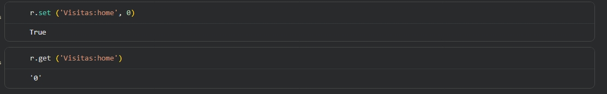
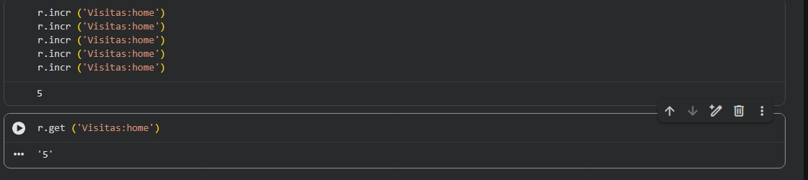
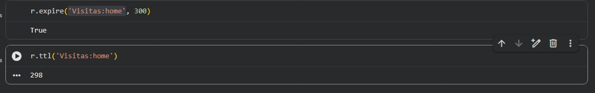
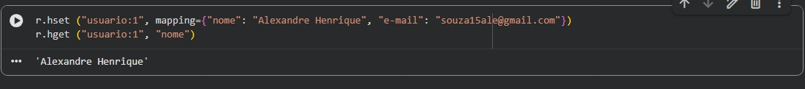

# Entrega — Atividade Prática Aula 3 (Redis Cloud)

**Disciplina:** IBD-016 — Banco de Dados Não Relacional
**Nome do aluno:** _Alexandre Henrique de Souza_
**Data de execução:** 04/09/2026 
**Nome do banco criado no Redis Cloud:** ibd016-aula3
**Ferramenta utilizada:** (RedisInsight / redis-cli / Google Colab)

> Instruções: para cada passo, execute o comando indicado (via RedisInsight, `redis-cli` ou Google Colab) e cole a saída real obtida no campo correspondente, adicionando o print da tela logo abaixo. Se estiver usando o **Google Colab**, o print pode ser da célula executada com seu código e a saída exibida abaixo dela — não é necessário usar a sintaxe nativa do Redis, os métodos Python (`r.set()`, `r.get()`, etc.) são aceitos normalmente. Para inserir uma imagem no GitHub, arraste o arquivo de print para dentro desta caixa de edição — o link é gerado automaticamente no formato ``.

---

## Passo 1 — Criar o contador zerado

**Comando/código executado:**
```
SET visitas:home 0
```

**Saída obtida:**
```
(True, 0)
```

**Print da tela:**



---

## Passo 2 — Simular 5 acessos (INCR executado 5 vezes)

**Comandos/código executados:**
```
INCR visitas:home
INCR visitas:home
INCR visitas:home
INCR visitas:home
INCR visitas:home
GET visitas:home
```

**Saída obtida (valor final do GET):**
```
(5, 5)
```

**Print da tela:**



---

## Passo 3 — Definir expiração de 5 minutos (300 segundos)

**Comandos/código executados:**
```
EXPIRE visitas:home 300
TTL visitas:home
```

**Saída obtida:**
```
(True, 298)
```

**Print da tela:**



---

## Passo 4 — Criar o cadastro do usuário como hash

**Comandos/código executados:**
```
HSET usuario:1 nome "SEU NOME AQUI" email "seuemail@exemplo.com"
HGET usuario:1 nome
```

**Saída obtida:**
```
(Alexandre Henrique)
```

**Print da tela:**



---

## Passo 5 — Reflexão final (2 a 3 linhas)

_Explique com suas palavras: por que o comando `INCR` é útil para um contador, e por que faz sentido usar `EXPIRE` nesse cenário?_

```
(O comando INCR é muito útil para contadores pois deixa tudo mais rápido e eficaz, não precisamos utilizar varias vezes o get ou set para adicionar novas contagem, já o EXPIRE ajuda no quesito update do banco, encerrando um contador por via do timer, abrindo espaço para novos contadores, aumentado eficiência e otimização das locações de memória.)
``` 

---

## Checklist antes de enviar

- [x] Todos os 4 passos têm comando, saída e print preenchidos
- [x] As imagens abrem corretamente ao visualizar o arquivo `.md` (confira antes de enviar)
- [x] A reflexão final do Passo 5 foi respondida
- [x] Nome do aluno e data preenchidos no topo do arquivo
